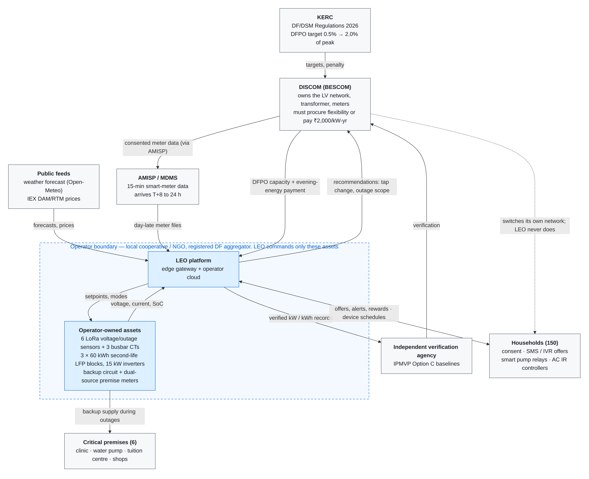
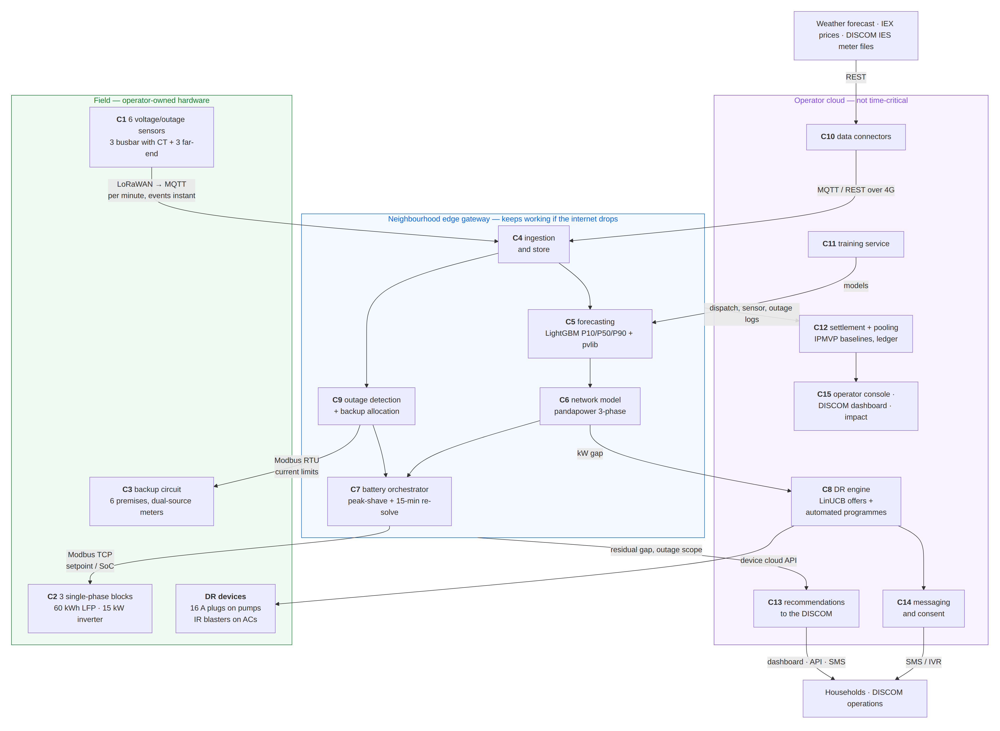
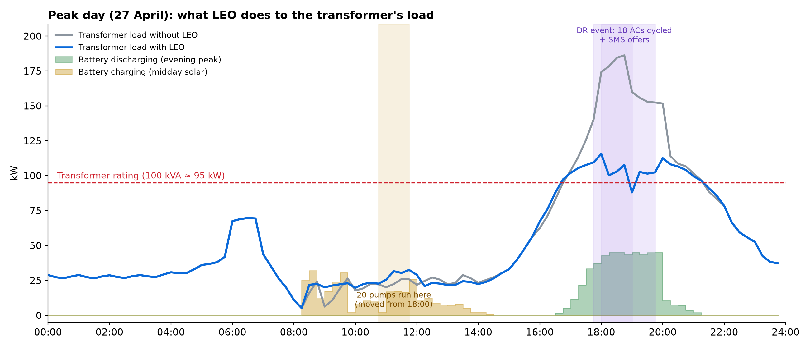
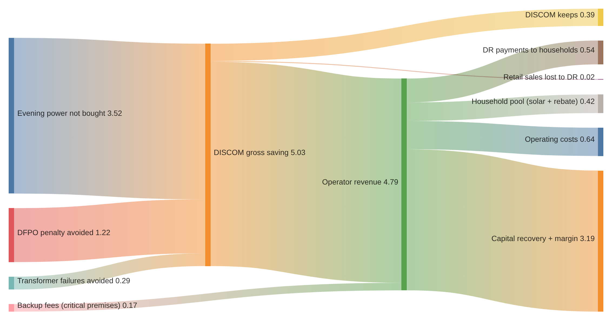
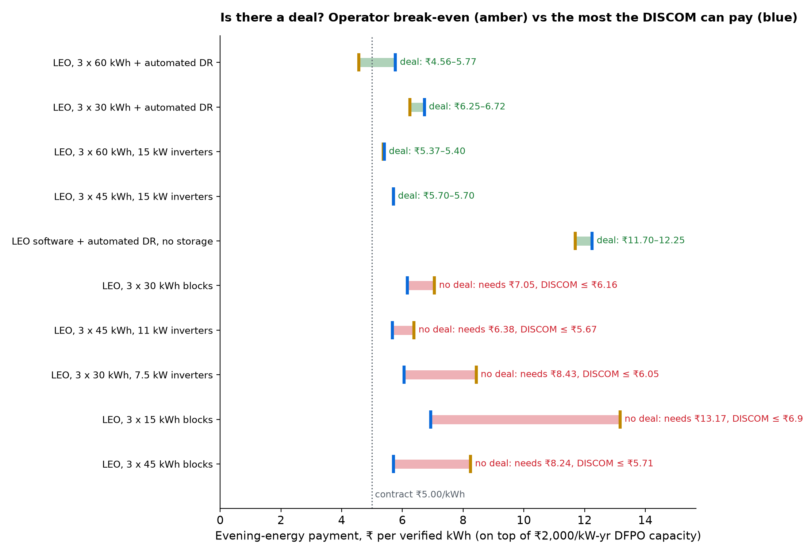

# LEO — Local Energy Orchestrator

**Neighbourhood-scale flexibility that keeps clean power dependable on India's most stressed distribution transformers.**

Submission for the **Yuva Yodha Energy Tech Hackathon** · Challenge: **Grid Reliability — Renewable Intermittency**
Team: **Siddharth Kini · Priyanshu Tiwari**

📄 Full write-up: [`docs/writeup/LEO_Detailed_Documentation.pdf`](docs/writeup/LEO_Detailed_Documentation.pdf) (46 pages, 76 references)
📁 High-resolution figures, demo video and documentation: [Google Drive folder](https://drive.google.com/drive/folders/17-y-rsIEqzmaN_z9JdgjO-jhdBZ274j8?usp=drive_link)

---

## Contents

1. [At a glance](#at-a-glance)
2. [The problem](#the-problem)
3. [What we proposed](#what-we-proposed)
4. [How it works](#how-it-works)
5. [Architecture](#architecture)
6. [What we implemented](#what-we-implemented)
7. [Results](#results)
8. [Unit economics](#unit-economics)
9. [Ownership and operations](#ownership-and-operations)
10. [What makes it different](#what-makes-it-different)
11. [Running it locally](#running-it-locally)
12. [Repository layout](#repository-layout)
13. [Prototype vs real deployment](#prototype-vs-real-deployment)
14. [Roadmap and future scope](#roadmap-and-future-scope)

---

## At a glance

Results per 100 kVA transformer per year, for the recommended design (three 60 kWh second-life battery blocks on 15 kW inverters, plus automated demand response), against an identical simulated world without LEO.

| Metric | Without LEO | With LEO |
|---|---|---|
| Average evening peak at the transformer (rating ≈ 95 kW) | 129 kW | **72 kW** (−44%) |
| Worst-day evening peak | 167 kW | **108 kW** |
| Hours per year above the transformer's rating | 967 h | **130 h** |
| Critical premises (clinic, water pump, school, shops) powered through outages | 0% | **100%** |
| Expected transformer failure rate per year (IEEE C57.91 ageing) | 5.8% | **0.1%** |
| Customer-hours of low voltage | 59,085 | **34,227** (−42%) |
| Verified peak reduction for the DISCOM's flexibility obligation | — | **60.9 kW** |
| DISCOM gross saving | — | **₹5.03 lakh/yr** |
| Operator payback | — | **5.0 years** (10-year NPV ₹1.10 L) |
| Upfront cost to households | — | **₹0**, bills unchanged |

---

## The problem

Distribution transformers (DTs) are where renewable intermittency and growing evening demand collide. Four facts about Indian distribution grids shape the problem:

| Fact | Evidence |
|---|---|
| **The evening ramp is daily and predictable.** Solar drives midday prices to the floor and disappears at sunset, exactly when cooling and lighting peak. | Midday blocks average ~₹1.91/kWh; evening prices routinely hit the ₹10/kWh exchange ceiling — an evening premium of ~₹7.92/kWh. |
| **Transformers fail from thermal overload.** Peri-urban DTs grew with their neighbourhoods without being upgraded. | BESCOM lost 38,288 of 497,991 DTs (7.96%) in FY 2023-24; sustained overload causes 29% of failures. A 100 kVA unit costs ~₹5.05 lakh to replace, and a failure means a multi-day outage for everyone on it. |
| **The DISCOM is blind below the feeder, and household data arrives a day late.** | Only ~3% of DT meters were communicating in 2024. Smart-meter (AMISP) service levels deliver 15-minute data 8–24 hours late — any design that assumes live household data won't work in the field. |
| **Flexibility is now an obligation.** | Maharashtra (2024) and Karnataka (2026) regulations create Demand Flexibility Portfolio Obligations (DFPO), measured in kW at the peak instant, with a ₹2,000/kW-yr shortfall penalty, and recognise aggregators. |

So DISCOMs need a source of **verifiable, local kW** — and a low-income neighbourhood with an overloaded DT is where that kW is worth the most.

---

## What we proposed

LEO is the **missing coordination layer between the DISCOM's feeder-level systems and the households on one transformer**. It is run by a local cooperative, NGO or self-help-group federation registered as a demand-flexibility aggregator.

### What is installed at one transformer

| Component | Detail |
|---|---|
| **6 low-cost sensors** (LoRaWAN) | Voltage/outage sensors at the DT busbar (one per phase, with a current transformer) and at the far end of each phase |
| **3 shared storage blocks** | One per phase: 60 kWh second-life LFP pack + BMS + 15 kW hybrid inverter with a grid port and a backup port. Per-phase because Indian LV networks are unbalanced. |
| **Backup circuit** | A separate LV cable from the batteries' backup ports to 6 registered critical premises (clinic, borewell pump, tuition centre, shops), each with a current-limited dual-source meter |
| **Automated DR devices** | ₹2,090 smart plug on water pumps, ₹999 IR blaster on ACs, in enrolled homes |
| **Edge gateway** | Raspberry Pi-class device on UPS — planning, live control and outage response keep running if the internet drops |
| **Operator cloud** | Forecast training, DR engine, settlement, recommendations and the web consoles |

### Who runs it and who pays

| Actor | Owns | Controls | Relationship |
|---|---|---|---|
| **DISCOM** | LV network, DT, meters, meter data | Switching, taps, crews, restoration | Buys verified flexibility under DFPO; receives recommendations |
| **Operator** (cooperative / NGO) | Sensors, batteries, backup circuit, devices, LEO | Only its own assets and messages | Earns a two-part DFPO contract; pays households |
| **Households** (150 per DT) | Their appliances, their consent | Whether to respond or override | Paid for DR and from a revenue pool; **pay nothing, risk nothing** |
| **Critical premises** (6) | Their loads | — | Small backup subscription and per-kWh fee |

**LEO commands only the operator's own assets. Everything on the DISCOM network is a recommendation.**

---

## How it works

LEO plans a day ahead (because household data is a day late) and corrects live from its own sensors.

| When | Step | What happens |
|---|---|---|
| D-1, 19:30 | **Forecast** | Per-phase P10/P50/P90 net load for the next 24 h from weather, calendar and day-late meter history (LightGBM quantile + pvlib solar) |
| D-1, 19:30 | **Model the network** | Three-phase power flow on the forecast: which bus, which hour, how far out of limits, and the safe charge/discharge limit for each battery |
| D-1, 19:30 | **Plan storage and DR** | Fill each block from midday solar, spread its energy over the evening peak; move enrolled pumps into the solar window; on the year's most stressed days, call an automated AC event and send SMS offers |
| D-1, 23:30 | **Operator approves** | In the console, where every action carries its reason. Nothing runs until approved. |
| Day D, every 15 min | **Live correction** | Re-solve battery setpoints from the busbar sensors; absorb midday overvoltage; on a load-shedding notice enter Pre-outage; on grid loss run the backup circuit |
| Day D | **Escalate** | Problems LEO can't fix locally (e.g. undervoltage on long lines) become structured recommendations to the DISCOM, such as a tap change |
| D+1 | **Settle** | When meter data arrives, verify reductions against IPMVP baselines and a random holdout; pay DR first, then the household pool |

### Key techniques

| Area | Approach | Why |
|---|---|---|
| Forecasting | LightGBM quantile model, latency-respecting features; pvlib with clear-sky calibration for invisible rooftop PV | Held-out evening-peak error 1.9% (MAPE); actual load exceeded P90 only 5.1% of the time |
| Network | pandapower unbalanced three-phase power flow on a feeder built from the real OpenStreetMap street grid | A battery action never creates a violation of its own |
| Battery planning | Water-filling peak shave, the same solver day-ahead and every 15 minutes; a convex reference-trajectory (IRT) planner after Huang et al. is implemented as the upgrade path | Energy goes to the highest-load intervals, so the battery never empties before the peak |
| Demand response | Automated pump shifting (daily) and AC cycling (stress days, ₹75/home/event); SMS offers chosen by a **contextual bandit** (disjoint LinUCB) at ₹0/25/50/100 | Reliable kW where the regulation values it; pays real money only where it buys a real cut |
| Outages | Sensor-pattern fault classification; inverters anti-island (IEC 62116); backup by priority (health > water > livelihood); staggered re-transfer | Critical premises stay up; no cold-load surge on restoration |
| Settlement | IPMVP Option C baselines, 10% random holdout, payouts sized from realised revenue, never negative | Defensible to an independent verification agency; no blockchain, no penalties |

### Operating modes

```
Normal ──(DISCOM load-shedding notice)──► Pre-outage ──(grid lost)──► Backup ──(grid back)──► Restoration ──► Normal
   └───────────────────────────(unplanned fault)───────────────────────┘
```

---

## Architecture

The operator commands only assets it owns, and everything that must keep working through an internet outage runs on the neighbourhood edge gateway.

| Tier | Runs | Talks over |
|---|---|---|
| **Field** | Sensors, current transformers, 3 hybrid inverters + battery packs, premise meters, smart plugs / IR blasters | LoRaWAN, Modbus TCP/RTU (SunSpec) |
| **Edge gateway** (offline-capable) | Live correction, outage detection, backup allocation, local plan execution | MQTT, Modbus |
| **Operator cloud** | Forecast training, day-ahead planning, DR engine, settlement, recommendations, consoles | REST, SMS gateway, meter-data exchange (MDMS / India Energy Stack) |

<p align="center">
  
  <br/><em>System context: LEO commands only what is inside the operator's boundary; the DISCOM switches its own network.</em>
</p>

<p align="center">
  
  <br/><em>Layered architecture with the protocol on each link.</em>
</p>

### Integration with existing DISCOM infrastructure

| Standard / system | Prototype | Real-world integration |
|---|---|---|
| Smart meters: AMISP head-end system → MDMS (DLMS/COSEM, IS 15959/16444) | Synthetic meter data released on the AMISP SLA schedule | Consented export from the DISCOM's MDMS or the India Energy Stack |
| India Energy Stack (Beckn, W3C DID/VC) | Mock endpoint, same schema | Consented meter-data exchange |
| MQTT, LoRaWAN (IN865), ChirpStack | Mosquitto broker, simulated payloads | Same |
| Modbus TCP / SunSpec | pymodbus mock inverters | Real hybrid inverters |
| IEC 61968/61970 (CIM) | Not yet — recommendations use LEO's own JSON schema | Recommendations exported as CIM messages to the DISCOM's ADMS/OMS |
| DNP3, IEC 60870-5-104, IEC 61850 | Not used | DISCOM-internal; **LEO never writes to it** |
| OpenADR / IEEE 2030.5 | Not used | DISCOM-to-aggregator DR event signals |
| IPMVP Option C | Baselines + holdout in settlement | Verification by empanelled agencies |
| TRAI DLT, DPDP Act 2023, UPI | Mock SMS, per-purpose consent, ledger | Registered SMS, legal consent basis, monthly payouts |

Recommendations are stored today as structured JSON (recommendation ID, DT, phase, time window, issue, recommended action, local actions already tried, evidence), served over the API and shown as text on the DISCOM dashboard. Because the schema is fixed and machine-readable, it can later be exported in the standard formats a DISCOM's control-room software uses.

---

## What we implemented

The whole system runs locally with one `docker compose up`: mock field devices, the edge gateway, the operator cloud and the web consoles, against a **closed-loop simulator**. All models execute for real; the consoles replay recorded runs from Postgres.

### Recorded scenarios

| Recording | What it shows |
|---|---|
| **Peak day, 27 Apr** — with and without LEO | The year's highest-demand day: forecast, plan, pump shift, AC event, SMS offers, live correction, escalations |
| **Announced load shedding** | DISCOM notice at 14:00 → Pre-outage → cut 19:40–21:10 → backup for 6 critical premises → staggered restoration |
| **Unplanned outage** | Upstream fault at 19:40 with no warning: detection from sensors, backup from remaining charge |
| **Sunny surplus day, 11 Feb** — with and without LEO | Midday overvoltage from rooftop solar; batteries soak up the surplus |

### Operator console (`/operator`)

| Screen | What it does |
|---|---|
| **Map** | deck.gl map over real satellite imagery: feeder lines coloured by voltage, icons for the transformer, per-phase batteries (filled to live charge), sensors and critical premises. Replay any recording on a timeline; compare with and without LEO; one plain-language situation banner using only values at the current moment |
| **What LEO predicted** | Forecast vs actual transformer loading; one card per predicted event with when, why, LEO's response and the outcome |
| **What LEO did, and why** | Time-ordered action log, each entry with its reason; click to jump the replay |
| **Plan review** | The 23:30 decision: per-phase charts (forecast band, load after plan, battery in/out, rating), expected outcome table, demand response in the plan; **approve, reject with a reason, or withdraw**, with a decision history |
| **Live** | Battery charge and far-end voltage per phase through the day; live corrections grouped into episodes |
| **DR events** | Automated pump/AC programmes and SMS offers: messaged, accepted, held back, verified saving |
| **Settlement** | Daily payouts by stream with the share of claims funded, grouped by household |
| **Members** | Household registry with phase, solar, business and critical-premise filters |

### DISCOM dashboard (`/discom`) and citizen app (`/citizen`)

| App | What it does |
|---|---|
| **DISCOM — Action queue** | Recommendations (tap-change raise, review inverter settings, outage scope) with window, phase, evidence and JSON; open → acknowledged → dispatched → resolved |
| **DISCOM — Reporting, Impact & economics** | Verified flexibility against the holdout, DFPO progress, results for every configuration, deal zone, sensitivity and the assumptions register |
| **Citizen app** | Earnings and latest offer in plain language, day-late usage clearly labelled, per-purpose consent, outage and community totals |
| **SMS / IVR** | Offers and alerts through a mock SMS service (IVR designed, not built) so households without smartphones aren't excluded |

### Technology stack

| Layer | Technology |
|---|---|
| Simulation | Python: numpy, pandas, pandapower (3-phase power flow), pvlib, osmnx, Open-Meteo weather history |
| Forecasting | LightGBM quantile models; pvlib with clear-sky calibration |
| Planning | Water-filling peak-shave planner; cvxpy/OSQP reference-trajectory planner |
| Demand response | Disjoint LinUCB contextual bandit; hidden behavioural personas in the simulator |
| Field interfaces | Mosquitto MQTT; pymodbus TCP/RTU mock batteries and meters; mock SMS; mock India Energy Stack |
| Data and APIs | PostgreSQL 16; FastAPI + asyncpg |
| Web | Next.js 15 (App Router), React 19, Tailwind CSS 4, deck.gl 9, IBM Plex Sans |
| Packaging | Docker Compose |

---

## Results

### Evaluation method

- **World:** a real Hoskote (Bengaluru Rural) street grid from OpenStreetMap, one overloaded 100 kVA DT, 150 households at real building footprints across three phases; bottom-up appliance loads every 15 minutes; 25% with rooftop PV; one real year of Open-Meteo weather; ~50 outages a year plus announced load-shedding cuts.
- **Protocol:** one week in every month (84 days across summer, monsoon and winter) replayed under each configuration, scaled to a year. Every configuration sees the **same world, weather, outages and households**, so differences come from LEO's decisions alone. Forecasts are retrained in quarterly folds with evaluated weeks held out.
- **Metrics:** outage hours (M1), voltage quality (M2), critical-premise availability (M3), evening peak (M4), verified flexibility on DFPO days (M5), transformer ageing (IEEE C57.91), technical losses.

### Reliability by configuration (per transformer per year)

| Configuration | Evening peak avg (kW) | Worst day (kW) | Verified kW (M5) | Critical availability (M3) | DT failure rate | Hours overloaded | Undervoltage cust-h (M2) | Losses (kWh) |
|---|---:|---:|---:|---:|---:|---:|---:|---:|
| Baseline (no LEO) | 129 | 167 | 0 | 0% | 5.8% | 967 | 59,085 | 11,890 |
| LEO software + SMS DR, no storage | 129 | 166 | 1.4 | 0% | 5.1% | 967 | 59,137 | 11,882 |
| LEO software + automated DR, no storage | 116 | 145 | 19.7 | 0% | 1.8% | 951 | 47,023 | 11,290 |
| LEO, 3 × 15 kWh blocks | 108 | 150 | 20.5 | 87% | 2.0% | 937 | 54,219 | 11,550 |
| LEO, 3 × 60 kWh, 15 kW inverters | 83 | 119 | 47.5 | 100% | 0.2% | 266 | 44,991 | 10,855 |
| **LEO, 3 × 60 kWh + automated DR (recommended)** | **72** | **108** | **60.9** | **100%** | **0.1%** | **130** | **34,227** | **10,360** |

Other headline results for the recommended design:

| Result | Value |
|---|---|
| Critical-premise outage hours kept powered | 443 premise-hours/yr |
| Customer-hours of transformer-failure outages avoided | 414/yr |
| Rooftop solar stored locally instead of exported | 49,836 kWh/yr |
| Pump load moved out of the evening | 5.5 MWh/yr |
| Technical losses avoided | 1,529 kWh/yr (−12.9%) |
| Peak day (27 Apr) transformer peak | 186 kW → 116 kW |

<p align="center">
  
  <br/><em>The intermittency bridge on the peak day: midday charging from rooftop solar, 20 pumps moved to 10:45, evening discharge across the peak, and the automated AC event with SMS offers.</em>
</p>

**Where storage matters and where DR matters:** automated DR alone cuts the evening peak by about 13 kW at very low capital cost; storage is what protects critical premises and the transformer; together they reach a 60.9 kW verified cut.

**What LEO does not do:** it cannot prevent upstream faults or load shedding, only prepare for them and protect registered premises — homes not on the backup circuit still lose supply. It cannot fix voltage drop along long lines from the transformer end; that is escalated to the DISCOM. The results come from a synthetic world calibrated to public data and Indian pilots (simulated SMS acceptance is 23% against Tata Power-DDL's 56%, deliberately conservative; automated AC events deliver ≈0.08 kW per customer, inside the 0.03–0.16 kW measured by the BYPL/AEEE pilot). Field validation is the first step of the roadmap.

---

## Unit economics

Every price comes from a tariff order, market data, a regulator, a DISCOM report or an Indian pilot, or is flagged for verification, in one assumptions file ([`economics.yaml`](economics.yaml)). Physical quantities come from the simulation, so a price can change without re-running it.

### Capital and operating cost (per DT)

| Capital item | ₹ | | Operating item (per year) | ₹ |
|---|---:|---|---|---:|
| Battery packs (3 × 60 kWh, second-life, ₹5,000/kWh) | 9.00 L | | Technician (shared across 20 DTs) | 19,287 |
| Inverters (3 × 15 kW) | 3.60 L | | Cloud and connectivity | 4,800 |
| Installation | 1.69 L | | SMS | 613 |
| Smart relays and controllers | 62,871 | | Insurance | 15,854 |
| Sensors and gateways | 59,500 | | Maintenance | 23,781 |
| Backup circuit | 24,000 | | | |
| Registration and setup | 10,295 | | | |
| **Total capex** | **15.85 L** | | **Total opex** | **64,336** |

### Operator P&L (per DT per year)

Two-part contract: ₹2,000/kW-yr for 60.9 verified kW + ₹5.00 per verified evening kWh (50,630 kWh/yr).

| Line | ₹ per year |
|---|---:|
| DFPO capacity payment | 1.22 L |
| Evening energy payment | 2.53 L |
| Energy settlement on the operator's ToD connection | 87,264 |
| Backup fees from critical premises | 16,733 |
| **Revenue** | **4.79 L** |
| Paid to households (DR first, then the pool) | −95,786 |
| Operating costs | −64,336 |
| **Net cash** | **3.19 L** |
| **Payback / 10-year NPV at 10%** | **5.0 years / ₹1.10 L** |

### DISCOM (per DT per year, vs no LEO)

| Line | ₹ per year |
|---|---:|
| Evening power purchase avoided (hour-by-hour prices) | 3.52 L |
| DFPO shortfall penalty avoided | 1.22 L |
| Transformer failures avoided | 29,003 |
| **Gross saving** | **5.03 L** (₹50.32 Cr across 1,000 overloaded DTs) |
| Paid to the operator (capacity + energy + settlement) | −4.62 L |
| Retail revenue lost to DR | −2,108 |
| **Net after paying the operator** | **38,890** |

<p align="center">
  
  <br/><em>Money flow per transformer per year (₹ lakh).</em>
</p>

### Is there a deal?

The operator breaks even at **₹4.56** per verified evening kWh and the DISCOM gains up to **₹5.77**; the ₹5.00 contract rate sits inside this **deal zone**, with a combined 10-year value of ₹3.49 L. Smaller batteries and SMS-only DR do not close.

<p align="center">
  
  <br/><em>Operator break-even rate vs the most the DISCOM can pay, by configuration.</em>
</p>

| What has to stay true (one at a time) | Threshold | Assumed |
|---|---|---|
| DFPO shortfall penalty | ≥ ₹1,067/kW-yr | ₹2,000 (MERC) |
| DISCOM evening power price | ≥ ₹8.73/kWh | ₹10.00 |
| Second-life battery price | ≤ ₹6,223/kWh | ₹5,000 |
| Insurance + maintenance | ≤ 6.1% of capex | 2.5% |

### What households get

| Who | Per year | How |
|---|---|---|
| Pump home (21 homes) | ₹2,027 | ₹100/month + ToD bill saving + pool share |
| AC home (19 homes) | ₹1,774 | ₹75 per event × ~20 events + pool share |
| Every other home | ₹282 | Pool share + any SMS offers accepted |
| Critical premise | Backup at ₹12/kWh + ₹150/month | vs a ₹15,000+ lead-acid inverter or a diesel genset |

Upfront cost ₹0, electricity bills unchanged, no penalties anywhere. For comparison, Tata Power-DDL's pilot paid about ₹2,250/yr to a household attending nine events.

### Impact at scale (1,000 overloaded DTs)

| Per DT per year | Per 1,000 DTs per year |
|---|---|
| ₹5.03 L DISCOM gross saving | ₹50.32 Cr |
| 50.6 MWh evening power not bought | 50.6 GWh |
| 60.9 kW verified flexibility | 60.9 MW towards DFPO |
| DT failure rate 5.8% → 0.1% | ≈57 fewer DT failures (₹2.90 Cr) |
| 443 premise-hours of critical supply kept | 443,000 premise-hours |
| 49.8 MWh rooftop solar used locally | 49.8 GWh |

---

## Ownership and operations

- **Operator:** a cooperative / NGO aggregator runs a cluster of ~20 DTs (one O&M section or gram panchayat) with **one skilled technician**.
- **Daily work:** about 10 minutes per DT to review and approve tomorrow's plan; follow up DISCOM recommendations; answer household queries.
- **Maintenance:** monthly BMS health review; battery packs replaced at min(7 years, 2,500 cycles); every component fails safe (inverters revert to safe defaults, households revert to manual, the gateway runs its last plan offline).
- **Legal basis:** KERC DF/DSM Regulations 2026 for the aggregator role; Electricity Act Section 13 / 14 for the backup circuit; DPDP Act consent; TRAI DLT for SMS.
- **Governance:** the household revenue share, backup fee and offer levels are set by members each year; the ledger is open to members; payouts can never exceed realised revenue.

---

## What makes it different

| | |
|---|---|
| **Built around day-late data** | Plans a day ahead from forecasts and corrects live only from six cheap sensors and the batteries' own CTs — engineered for India's AMISP reality |
| **Per-phase everything** | Three single-phase second-life blocks, per-phase forecasts and safe limits — matched to unbalanced Indian LV networks |
| **One solver for plan and live** | The operator approves what actually runs, and the battery can't run empty before the peak |
| **DR designed for the DFPO** | Buys kW where the regulation values it: automated devices for reliable kW, daily pump shifting for energy, a bandit that pays only where it buys a real cut |
| **A deal, not a subsidy** | A two-part contract derived from the DISCOM's own avoided costs, with a computed deal zone to negotiate in |
| **Honest settlement** | Payouts sized from realised revenue, random holdouts for causal verification, no blockchain, no penalties |
| **Explainability as a feature** | Every predicted event has reasons, every action has a why, every outcome is compared with the forecast |
| **Advisory to the DISCOM** | Commands only operator-owned assets; the DISCOM keeps full control of its network |

---

## Running it locally

### Requirements

- Docker with Docker Compose
- Python 3.12 (to build the simulated world and record the scenarios)
- Ports 3000 (web), 8030 (API), 5433 (Postgres), 1883 (MQTT), 5020–5021, 8010–8012, 8020 free

### 1. Start the stack

```bash
docker compose up -d --build
```

This starts Postgres (schema from `contracts/ddl.sql`), the MQTT broker, mock field devices (Modbus batteries and meters, SMS, India Energy Stack), the clock, the edge gateway, the cloud API and the web app.

### 2. Build the world and record the scenarios

The consoles replay recorded runs, so a fresh database needs them generated once:

```bash
python3.12 -m venv .venv && source .venv/bin/activate
pip install -r requirements.txt

export POSTGRES_PORT=5433
python -m world.build                         # neighbourhood, households, sensors, batteries → Postgres
python -m sim.loop                            # records all six scenarios (trains the forecast, ~10+ min)
python -m cloud.settlement.run_settlement     # next-morning settlement for the peak day
python -m cloud.recommendations               # DISCOM recommendations
```

### 3. Open the consoles

Go to <http://localhost:3000> and sign in with a prototype login:

| Role | Username / password | Lands on |
|---|---|---|
| Operator | `operator` / `operator` | `/operator` — map, plan review, live, DR, settlement, members |
| DISCOM | `discom` / `discom` | `/discom` — action queue, reporting, impact & economics |
| Household | `household` / `household` | `/citizen` — a real household from the peak-day run |

### 4. (Optional) Re-run the year-long evaluation

```bash
python -m eval.sweep --sweep-id year          # 84 days × every configuration
python -m eval.economics --sweep-id year      # prices the sweep with economics.yaml
```

---

## Repository layout

```
.
├── world/          Simulated neighbourhood: OSM feeder, households, PV, weather, outages, IRT library
├── sim/            Closed-loop simulator that records the demo scenarios into Postgres
├── gateway/        Edge gateway: day-ahead forecast and plan, live correction, outage handling
├── cloud/          FastAPI API, DR engine (LinUCB), settlement, recommendations, explainability
├── mocks/          Mock field devices: Modbus batteries and meters, SMS service, India Energy Stack
├── contracts/      Database schema (ddl.sql), Modbus register map, MQTT topics, JSON schemas
├── eval/           Year-sampled sweep, reliability metrics and unit economics
├── web/            Next.js app: operator console, DISCOM dashboard, citizen app
├── docs/
│   ├── diagrams/   Architecture and results figures (Mermaid sources, SVG, PNG)
│   └── writeup/    Submission document source and PDF
├── scenario.yaml   Simulation scenario (neighbourhood, adoption, DR, outages)
├── economics.yaml  Every price and cost, each tagged with its source
└── docker-compose.yml
```

---

## Prototype vs real deployment

| Area | In this prototype | In a real deployment |
|---|---|---|
| Household meter data | Synthetic, released on the AMISP SLA schedule by a mock endpoint | MDMS export or India Energy Stack, with consent |
| Voltage sensors | Simulated from power-flow voltages with noise and dropouts | LoRa loggers hosted with consent |
| Storage | Battery models behind a Modbus server | Second-life packs, BMS and hybrid inverters over Modbus TCP |
| Backup circuit | Simulated premise meters | Cable, changeover and dual-source meters; legal basis secured |
| Network topology | Generated from OpenStreetMap streets | DISCOM GIS / consumer indexing |
| Household behaviour | Hidden personas calibrated to Indian pilots | Real households |
| Smart devices | Modelled pump shift and AC cycling | Commercial smart plugs and IR blasters via their APIs |
| SMS / IVR | Mock service | DLT-registered provider; IVR in Kannada, Hindi, English |
| Payouts | Ledger only | UPI |
| Logins | Stub users per role | Managed authentication with the same roles |
| Gateway | Docker Compose on a laptop | Raspberry Pi-class device on UPS at the battery site |

**Simplifications to be aware of:** the neighbourhood is synthetic (real streets and weather, generated households); forecasts are scored on synthetic data, so field accuracy will be lower; DR responses come from calibrated personas; annual figures scale one week per month.

---

## Roadmap and future scope

| Phase | Timing | Scope | Exit criteria |
|---|---|---|---|
| 0 — Prototype | Done | Full system on a simulated world; year-sampled evaluation; unit economics | This repository and write-up |
| 1 — Shadow pilot | Months 0–6 | One overloaded peri-urban DT; 6 sensors; consented meter data; LEO forecasts and recommends only | Forecast accuracy on real data; DISCOM acceptance of recommendations |
| 2 — Active pilot | Months 6–15 | Three second-life blocks, backup circuit, smart devices; DR in April–September; IPMVP verification | Verified kW on DFPO days; critical-premise availability; payouts settled |
| 3 — Cluster | Months 15–30 | 20 DTs under one cooperative; two-part DFPO contract with the DISCOM | Operator cash-positive; DT failures tracked |
| 4 — Scale | Year 3+ | Multiple clusters and DISCOMs; OpenADR / IEEE 2030.5; convex planner; more devices | DFPO portfolio share; replication playbook |

**Next:** real DT data and forecast re-validation; field-validated DR enrolment and response; a contract negotiated inside the deal zone; the convex reference-trajectory planner as default; midday DR for solar surplus; DR events received over OpenADR; recommendations exported as IEC 61968/61970 CIM messages for the DISCOM's ADMS/OMS; federated forecasting across DTs.

---

<sub>All results are from a simulated world calibrated to public data and Indian pilots. Sources for every figure and price are listed in the [full write-up](docs/writeup/LEO_Detailed_Documentation.pdf).</sub>
